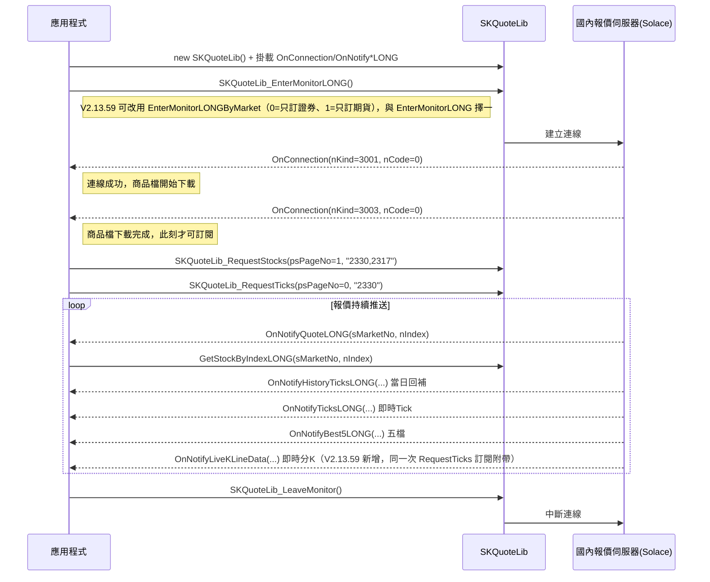
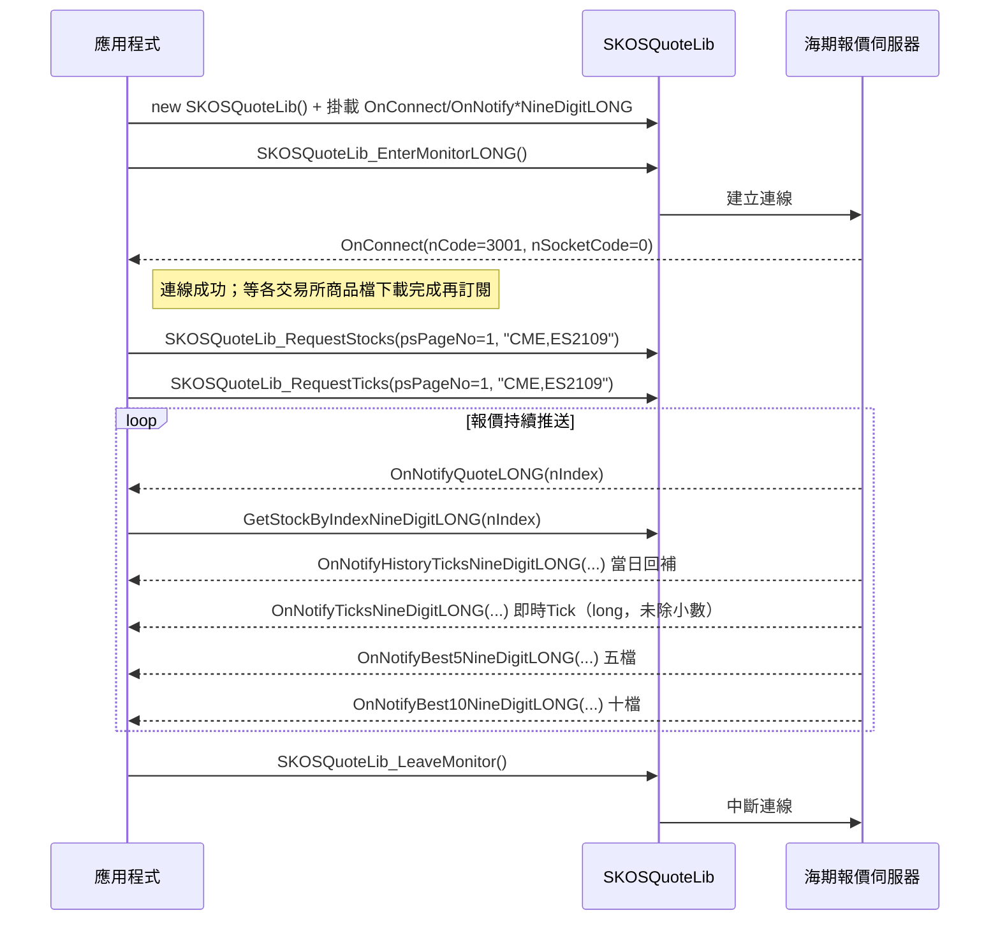
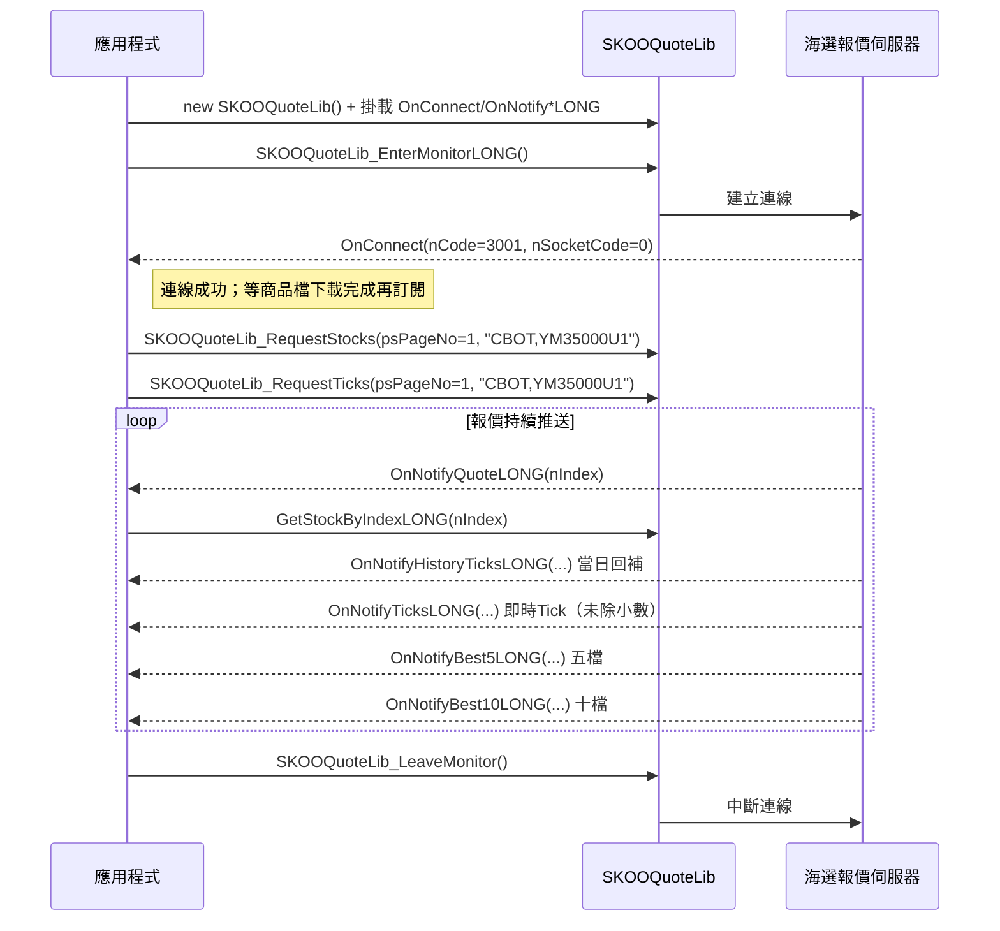

# 流程C：報價訂閱三型（國內／海期／海選）

> 版本基準 V2.13.59（以 V2.13.57 規格為底增補；差異見 [../changelog_2.13.57_to_2.13.59.md](../changelog_2.13.57_to_2.13.59.md)）。
> 來源：`api_spec/modules/SKQuoteLib.md`、`api_spec/modules/SKOSQuoteLib.md`、`api_spec/modules/SKOOQuoteLib.md`、`api_spec/_raw/13.國內報價.md`、`api_spec/_raw/14.海期報價.md`、`api_spec/_raw/15.海選報價.md`、官方 C# 範例 `SKCOMTester`；V2.13.59 增補處另引 `api_spec/_raw/v2.13.59/*.md` 與 `Source_code/CapitalAPI_2.13.59_CExample/`。
> **COM 介面未變、三段流程照走無誤**：截至 V2.13.59，三支報價元件的 Interop.SKCOMLib 符號與原生 SKCOM.dll 匯出皆無刪除（匯出 78→83、+5/−0，新增的 5 支全落在 SKOrderLib 的帳務／未平倉／權益數查詢：`GetRealBalanceReport`、`GetOpenInterestGW`、`GetFutureRights`、`GetOFOpenInterestGW`、`GetOFFutureRights`，與報價無關），本檔的連線→就緒→訂閱→接收→退出順序完全沿用。
> **但官方 V2.13.59 手冊已移除海期／海選報價章節，官方範例也一併下架海期／海選報價示範**：主手冊 4-5 SKOSQuoteLib／4-6 SKOOQuoteLib 兩整章消失，原位置改放 4-4-u OnNotifyLiveKLineData、章節編號由 4-4 直接跳 4-7（`api_spec/_raw/v2.13.59/策略王COM元件使用說明_V2.13.59.md:2905`、`:2920`），分冊 `14.海期報價`／`15.海選報價` 不存在於 .59 說明文件夾；`SKCOMTester/SKOSQuote.cs`、`SKCOMTester/SKOOQuote.cs` 亦不存在於 `Source_code/CapitalAPI_2.13.59_CExample/` 樹。**函式本身未移除（Interop 符號兩版一致），故段二（步驟 10–16）／段三（步驟 17–23）以 V2.13.57 留存原文為準**，其範例引用行號對應 `Source_code/CapitalAPI_2.13.57_CExample/` 樹。
> V2.13.59 對本流程的實質增補只在段一（國內）：新增即時分K（`OnNotifyLiveKLineData` + `SKQuoteLib_GetLiveKLineLONG` + `SKKLINE`）與指定市場連線（`SKQuoteLib_EnterMonitorLONGByMarket`）。

## 目標（一句話）

依國內（`SKQuoteLib`）、海外期貨（`SKOSQuoteLib`）、海外選擇權（`SKOOQuoteLib`）三支報價元件，各自完整走一次「連線 → 等待就緒 → 訂閱 → 接收事件 → 退出」的生命週期，讓 AI 能照抄本檔拼出可編譯、可運作的三種即時報價收單程式。

## 前置條件

三段皆共用以下前置（缺一則後面全部失敗）：

- 登入前必須先建立 `SKReplyLib` 物件並註冊 `OnReplyMessage` 事件（handler 內回傳 `sConfirmCode = -1`），否則 `SKCenterLib_Login` 失敗（錯誤碼 2017 相關）——`modules/SKReplyLib.md#OnReplyMessage`、`modules/SKReplyLib.md#陷阱與注意`
- `SKCenterLib_Login(帳號, 密碼)` 登入成功——`modules/SKCenterLib.md#SKCenterLib_Login`
- （選用）以 `SKCenterLib_RequestAgreement` 確認證券／期貨 API 下單聲明書簽署狀態；預設登入時已自動查詢一次——`modules/SKCenterLib.md#SKCenterLib_RequestAgreement`

各段額外前置：

| 段別 | 額外前置 | 出處 |
|---|---|---|
| 國內 SKQuoteLib | 需開立證券或期貨帳戶並簽署對應 API 下單同意書，否則對應市場查詢／訂閱回錯誤碼 3031 | `modules/SKQuoteLib.md#陷阱與注意`（第 10 點） |
| 海期 SKOSQuoteLib | 需先簽署期貨 API 下單聲明書 | `modules/SKOSQuoteLib.md#初始化與事件註冊`、`modules/SKOSQuoteLib.md#SKOSQuoteLib_EnterMonitorLONG` |
| 海選 SKOOQuoteLib | 需先簽署期貨 API 下單聲明書 | `modules/SKOOQuoteLib.md#SKOOQuoteLib_EnterMonitorLONG` |

事件掛載一律要在呼叫對應 `EnterMonitorLONG` **之前**完成（見三份 modules 檔各自的「初始化與事件註冊」節）。三個報價物件（`SKQuoteLib`／`SKOSQuoteLib`／`SKOOQuoteLib`）互相獨立，可同時建立、平行連線，不互相影響。

> **載體警告（V2.13.59）：走簡化版 `SKDLLCSharp.dll` 者，段二／段三已不可行，必須改走 COM。**
> V2.13.59 的簡化版 C# 包裝層移除了海期／海選整組報價方法——`SKOSQuoteLib_RequestStocks`／`SKOSQuoteLib_RequestTicks`／`SKOSQuoteLib_GetStockByNoNineDigitLONG` 與 `SKOOQuoteLib_RequestStocks`／`SKOOQuoteLib_RequestTicks`／`SKOOQuoteLib_GetStockByNoLONG` 六個方法在 .59 的 SKDLLCSharp.dll 已查無符號，官方範例對它們的呼叫也全部消失（`Source_code/CapitalAPI_2.13.57_CExample/SKDLLTester/SKDLLTester/Form1.cs:898`、`:1278`、`:3493`、`:3529`、`:3554`、`:3578` 共 6 處呼叫，`Source_code/CapitalAPI_2.13.59_CExample/SKDLLTester/SKDLLTester/Form1.cs` 則為 0 處）。包裝層手冊的「海期行情」「海選行情」兩大段整段刪除，`國內行情` 之後直接接「服務型」（`api_spec/_raw/v2.13.59/C_Sharp策略王DLL元件使用說明.md:504`、`:623`）。
> 連線目標也一併縮編：`ManageServerConnection` 說明由「與(回報/國內行情/海期行情/海選行情/下單)主機建立連線」改為「與(回報/國內行情/下單)主機建立連線」、`nTargetType` 由 0/1/2/3/4 縮為 `0:回報；1:國內行情；4:Proxy下單`，`nStatus` 也不再列「4:連線(備援(僅海期選))」（同檔 `:45`、`:49`、`:50`）。既有程式若以 `nTargetType=2/3` 連海期／海選行情，在 .59 包裝層已無對應連線目標。
> **底層 COM 完全未受影響**：段二／段三請以 COM 元件（`SKOSQuoteLib`／`SKOOQuoteLib`）直接呼叫 `EnterMonitorLONG` 等函式，`0`／`1`／`4` 三個 `nTargetType` 語意未重編號、其餘簡化版功能不受影響。

## 步驟總表

| # | 呼叫 | 所屬 lib | 說明 | 規格出處（modules/xx.md#節名） |
|---|---|---|---|---|
| 1 | `new SKReplyLib()` + 註冊 `OnReplyMessage`（回傳 `sConfirmCode=-1`） | SKReplyLib | 登入前必做的公告事件註冊 | `modules/SKReplyLib.md#OnReplyMessage` |
| 2 | `SKCenterLib_Login(bstrUserID, bstrPassword)` | SKCenterLib | 雙因子登入，三段報價的共同前提 | `modules/SKCenterLib.md#SKCenterLib_Login` |
| 3 | `new SKQuoteLib()` 並掛載 `OnConnection`／`OnNotifyQuoteLONG`／`OnNotifyTicksLONG`／`OnNotifyHistoryTicksLONG`／`OnNotifyBest5LONG`／`OnNotifyLiveKLineData`（**V2.13.59 新增**） | SKQuoteLib | 國內報價物件建立＋事件掛載（須在 EnterMonitorLONG 之前）；`OnNotifyLiveKLineData` 同樣要在連線前掛好，官方範例把它放在與其他事件同一段只執行一次的註冊區塊 | `modules/SKQuoteLib.md#初始化與事件註冊`；V2.13.59 新增事件：`api_spec/_raw/v2.13.59/13.國內報價.md:1114`、`Source_code/CapitalAPI_2.13.59_CExample/SKCOMTester/SKQuote.cs:144` |
| 4 | `SKQuoteLib_EnterMonitorLONG()`；或 **V2.13.59 新增**的 `SKQuoteLib_EnterMonitorLONGByMarket(nMarketType)`（`0`=只訂閱國內證券市場、`1`=只訂閱國內期貨市場） | SKQuoteLib | 與國內報價伺服器建立連線。官方明載兩者**擇一使用**；不指定市場就用原本的 `EnterMonitorLONG`（官方範例以下拉選單「0:證券／1:期貨／不指定」分流，選「不指定」或未選時走舊函式），舊寫法不受影響 | `modules/SKQuoteLib.md#SKQuoteLib_EnterMonitorLONG`、`modules/SKQuoteLib.md#SKQuoteLib_EnterMonitorLONGByMarket`；`api_spec/_raw/v2.13.59/13.國內報價.md:225-231`、`Source_code/CapitalAPI_2.13.59_CExample/SKCOMTester/SKQuote.cs:148-156`、`Source_code/CapitalAPI_2.13.59_CExample/SKCOMTester/SKQuote.Designer.cs:2786-2789`（下拉選項） |
| 5 | 等待 `OnConnection(nKind=3001)` 再等 `OnConnection(nKind=3003)` | SKQuoteLib | 3001=連線成功、3003=商品檔下載完成；3003 之前訂閱一律失敗 | `modules/SKQuoteLib.md#OnConnection` |
| 6 | `SKQuoteLib_RequestStocks(ref psPageNo, "2330,2317")`（psPageNo 固定帶 1）或 `SKQuoteLib_RequestStocksWithMarketNo(ref psPageNo, sMarketNo, ...)`（盤中零股／客製化期選，psPageNo 同樣固定帶 1） | SKQuoteLib | 訂閱即時報價（100 檔上限，兩函式擇一） | `modules/SKQuoteLib.md#SKQuoteLib_RequestStocks` |
| 7 | `SKQuoteLib_RequestTicks(ref psPageNo, "2330")`（psPageNo 從 0 開始） | SKQuoteLib | 訂閱成交明細＋五檔（含當日回補，10 檔上限）；**V2.13.59 起同一次訂閱另會推送即時分K（含當日分K回補）與「該分鐘每筆 Tick 更新一次分K」**——即時分K 沒有自己的訂閱函式，本函式就是唯一入口（手冊提到的 `RequestLiveKLine` 並不存在，見「常見錯誤」11） | `modules/SKQuoteLib.md#SKQuoteLib_RequestTicks`；V2.13.59 說明改寫：`api_spec/_raw/v2.13.59/13.國內報價.md:412`、`:418`、`api_spec/_raw/v2.13.59/策略王COM元件使用說明_V2.13.59.md:2277`、`:2283` |
| 8 | 接收 `OnNotifyQuoteLONG` / `OnNotifyHistoryTicksLONG` / `OnNotifyTicksLONG` / `OnNotifyBest5LONG` / `OnNotifyLiveKLineData`（**V2.13.59 新增**） | SKQuoteLib | `OnNotifyQuoteLONG` 內以 `(sMarketNo, nIndex)` 呼叫 `GetStockByIndexLONG` 取完整報價物件；`OnNotifyLiveKLineData` 依 `nType` 分流（`0`=資料重置／清盤，本筆價格全為 0 且須捨棄已收資料；`1`=即時分K，含當日回補、之後每分鐘一次；`2`=該分鐘每筆 Tick），價格為原始整數需自行依小數位還原，`nTimehm` 為不補零的 HHmm 整數。**只訂 Tick／五檔的既有程式在 .59 會多收到這個事件，事件端須能忽略未預期事件而不視為錯誤** | `modules/SKQuoteLib.md#OnNotifyQuoteLONG`、`modules/SKQuoteLib.md#OnNotifyLiveKLineData`；`api_spec/_raw/v2.13.59/13.國內報價.md:1117`、`:1118`、`:1121`、`:1127` |
| 9 | `SKQuoteLib_LeaveMonitor()` | SKQuoteLib | 中斷國內報價連線（含回報，不含模擬回報／公告） | `modules/SKQuoteLib.md#SKQuoteLib_LeaveMonitor` |
| 10 | `new SKOSQuoteLib()` 並掛載 `OnConnect`／`OnNotifyQuoteLONG`／`OnNotifyTicksNineDigitLONG`／`OnNotifyHistoryTicksNineDigitLONG`／`OnNotifyBest5NineDigitLONG`／`OnNotifyBest10NineDigitLONG` | SKOSQuoteLib | 海期報價物件建立＋事件掛載 | `modules/SKOSQuoteLib.md#初始化與事件註冊` |
| 11 | `SKOSQuoteLib_EnterMonitorLONG()` | SKOSQuoteLib | 與海期報價伺服器建立連線 | `modules/SKOSQuoteLib.md#SKOSQuoteLib_EnterMonitorLONG` |
| 12 | 等待 `OnConnect(nCode=3001, nSocketCode=0)` | SKOSQuoteLib | 3001=連線成功；商品檔（各交易所）未下載完成前訂閱會失敗，實務上等 log（`日期_OSQuote.log` 的 `LoadOSCommdity`）出現後再訂閱 | `modules/SKOSQuoteLib.md#OnConnect` |
| 13 | `SKOSQuoteLib_RequestStocks(ref psPageNo, "CME,ES2109")`（psPageNo 固定帶 1） | SKOSQuoteLib | 訂閱海期即時報價；商品格式「交易所代碼,商品報價代碼」，多筆以 `#` 分隔 | `modules/SKOSQuoteLib.md#SKOSQuoteLib_RequestStocks` |
| 14 | `SKOSQuoteLib_RequestTicks(ref psPageNo, "CME,ES2109")`（psPageNo 從 1 開始） | SKOSQuoteLib | 訂閱成交明細＋五檔＋十檔（九位小數擴充，含當日回補） | `modules/SKOSQuoteLib.md#SKOSQuoteLib_RequestTicks` |
| 15 | 接收 `OnNotifyQuoteLONG` / `OnNotifyHistoryTicksNineDigitLONG` / `OnNotifyTicksNineDigitLONG` / `OnNotifyBest5NineDigitLONG` / `OnNotifyBest10NineDigitLONG` | SKOSQuoteLib | 價格為 `long` 且未除小數，需依 `SKFOREIGN_9LONG.sDecimal`／`nDenominator` 自行換算 | `modules/SKOSQuoteLib.md#OnNotifyTicksNineDigitLONG` |
| 16 | `SKOSQuoteLib_LeaveMonitor()` | SKOSQuoteLib | 中斷海期報價連線 | `modules/SKOSQuoteLib.md#SKOSQuoteLib_LeaveMonitor` |
| 17 | `new SKOOQuoteLib()` 並掛載 `OnConnect`／`OnNotifyQuoteLONG`／`OnNotifyTicksLONG`／`OnNotifyHistoryTicksLONG`／`OnNotifyBest5LONG`／`OnNotifyBest10LONG` | SKOOQuoteLib | 海選報價物件建立＋事件掛載 | `modules/SKOOQuoteLib.md#初始化與事件註冊` |
| 18 | `SKOOQuoteLib_EnterMonitorLONG()` | SKOOQuoteLib | 與海選報價伺服器建立連線 | `modules/SKOOQuoteLib.md#SKOOQuoteLib_EnterMonitorLONG` |
| 19 | 等待 `OnConnect(nCode=3001, nSocketCode=0)` | SKOOQuoteLib | 3001=連線成功；商品檔未下載完成前訂閱會失敗 | `modules/SKOOQuoteLib.md#OnConnect` |
| 20 | `SKOOQuoteLib_RequestStocks(ref psPageNo, "CBOT,YM35000U1")`（psPageNo 固定帶 1） | SKOOQuoteLib | 訂閱海選即時報價 | `modules/SKOOQuoteLib.md#SKOOQuoteLib_RequestStocks` |
| 21 | `SKOOQuoteLib_RequestTicks(ref psPageNo, "CBOT,YM35000U1")`（psPageNo 從 1 開始） | SKOOQuoteLib | 訂閱成交明細＋五檔＋十檔（含當日回補） | `modules/SKOOQuoteLib.md#SKOOQuoteLib_RequestTicks` |
| 22 | 接收 `OnNotifyQuoteLONG` / `OnNotifyHistoryTicksLONG` / `OnNotifyTicksLONG` / `OnNotifyBest5LONG` / `OnNotifyBest10LONG` | SKOOQuoteLib | 價格未除小數，需依 `SKFOREIGNLONG.sDecimal` 自行換算；沒有海期的九位小數擴充版本 | `modules/SKOOQuoteLib.md#OnNotifyTicksLONG` |
| 23 | `SKOOQuoteLib_LeaveMonitor()` | SKOOQuoteLib | 中斷海選報價連線 | `modules/SKOOQuoteLib.md#SKOOQuoteLib_LeaveMonitor` |

> **步驟 10–23（海期／海選）的 V2.13.59 範圍註記**：呼叫順序與函式簽名在 .59 完全未變，但官方文件與範例已下架（見檔頭），步驟 10–23 的規格出處以 V2.13.57 留存原文為準。
> **步驟 12 的 log 判讀來源**：`日期_OSQuote.log` 內 `LoadOSCommdity` 的判讀說明，在 V2.13.59 只剩主手冊 4-2-39 `SKOrderLib_LoadOSCommodity` 備註一處（`api_spec/_raw/v2.13.59/策略王COM元件使用說明_V2.13.59.md:832`）；海期報價分冊已不存在，且 `api_spec/_raw/v2.13.59/9.下單-海外期選.md:185` 的同節備註也已刪掉這段文字（.59 只剩「具海期帳號，海期委託下單前須先下載」）。判讀方式本身未改，引用時請改指前者。

## 最小可運作 C# 骨架

三段各自獨立成一個檔案／類別即可平行運作；下面依官方範例逐段拼接，每段皆註明來源檔案與行號。

### 段一：國內 SKQuoteLib

```csharp
using SKCOMLib;   // 引用 Interop.SKCOMLib.dll
// 出處：Source_code/CapitalAPI_2.13.57_CExample/SKCOMTester/SKQuote.cs:9(using)

SKCOMLib.SKQuoteLib m_SKQuoteLib = new SKCOMLib.SKQuoteLib();
// 出處：SKCOMTester/SKQuote.cs:39（欄位宣告）

// 事件掛載：務必在 EnterMonitorLONG 之前完成，且只掛一次
// 出處：SKCOMTester/SKQuote.cs:124-143
m_SKQuoteLib.OnConnection             += new _ISKQuoteLibEvents_OnConnectionEventHandler(m_SKQuoteLib_OnConnection);
m_SKQuoteLib.OnNotifyQuoteLONG        += new _ISKQuoteLibEvents_OnNotifyQuoteLONGEventHandler(m_SKQuoteLib_OnNotifyQuote);
m_SKQuoteLib.OnNotifyHistoryTicksLONG += new _ISKQuoteLibEvents_OnNotifyHistoryTicksLONGEventHandler(m_SKQuoteLib_OnNotifyHistoryTicks);
m_SKQuoteLib.OnNotifyTicksLONG        += new _ISKQuoteLibEvents_OnNotifyTicksLONGEventHandler(m_SKQuoteLib_OnNotifyTicks);
m_SKQuoteLib.OnNotifyBest5LONG        += new _ISKQuoteLibEvents_OnNotifyBest5LONGEventHandler(m_SKQuoteLib_OnNotifyBest5);

// 連線
// 出處：SKCOMTester/SKQuote.cs:147
int m_nCode = m_SKQuoteLib.SKQuoteLib_EnterMonitorLONG();

// OnConnection：3001=連線、3002=斷線、3003=商品檔下載完成
// 出處：SKCOMTester/SKQuote.cs:404-430（節錄，事件內嚴禁呼叫 EnterMonitorLONG/RequestStocks 等）
void m_SKQuoteLib_OnConnection(int nKind, int nCode)
{
    if (nKind == 3001 && nCode == 0)      { /* 連線成功，等待商品檔下載 */ }
    else if (nKind == 3002)               { /* 斷線 */ }
    else if (nKind == 3003)               { /* 商品檔下載完成，此刻才可以訂閱 */ StartSubscribe(); }
}

// 訂閱：收到 3003 之後才呼叫。psPageNo 固定帶 1（見「常見錯誤」psPageNo 陷阱）
void StartSubscribe()
{
    short sPage = 1;
    // 出處：SKCOMTester/SKQuote.cs:269
    m_nCode = m_SKQuoteLib.SKQuoteLib_RequestStocks(ref sPage, "2330,2317");

    short sTickPage = 0;
    // 出處：SKCOMTester/SKQuote.cs:182
    m_nCode = m_SKQuoteLib.SKQuoteLib_RequestTicks(ref sTickPage, "2330");
}

// 出處：SKCOMTester/SKQuote.cs:456-463（節錄）
void m_SKQuoteLib_OnNotifyQuote(short sMarketNo, int nStockIdx)
{
    SKSTOCKLONG pSKStockLONG = new SKSTOCKLONG();
    m_SKQuoteLib.SKQuoteLib_GetStockByIndexLONG(sMarketNo, nStockIdx, ref pSKStockLONG);
    // pSKStockLONG.nClose / 100.0 等欄位即為報價
}

// 出處：SKCOMTester/SKQuote.cs:466（簽名節錄，內容處理略）
void m_SKQuoteLib_OnNotifyTicks(short sMarketNo, int nStockIdx, int nPtr, int nDate,
    int nTimehms, int nTimemillismicros, int nBid, int nAsk, int nClose, int nQty, int nSimulate) { /* ... */ }

void m_SKQuoteLib_OnNotifyHistoryTicks(short sMarketNo, int nStockIdx, int nPtr, int nDate,
    int nTimehms, int nTimemillismicros, int nBid, int nAsk, int nClose, int nQty, int nSimulate) { /* ... */ }

void m_SKQuoteLib_OnNotifyBest5(short sMarketNo, int nStockIdx, /* ...25 個五檔價量參數... */ int nSimulate) { /* ... */ }

// ───── V2.13.59 新增：即時分K ─────
// 事件掛載：與上面同一段「只跑一次」的註冊區塊，仍須在 EnterMonitorLONG 之前
// 出處：Source_code/CapitalAPI_2.13.59_CExample/SKCOMTester/SKQuote.cs:144
m_SKQuoteLib.OnNotifyLiveKLineData += new _ISKQuoteLibEvents_OnNotifyLiveKLineDataEventHandler(m_SKQuoteLib_OnNotifyLiveKLineData);

// 訂閱入口就是上面 StartSubscribe() 已呼叫的 SKQuoteLib_RequestTicks，不需要（也沒有）額外的訂閱呼叫：
//   * RequestLiveKLine 不存在（手冊誤植，見「常見錯誤」11）
//   * 也不要拿 SKQuoteLib_RequestLiveTick 代用（那是另一組即時Tick 功能，不是分K）
// 出處：api_spec/_raw/v2.13.59/13.國內報價.md:412（RequestTicks 說明改寫）、:418（相關通知事件含 OnNotifyLiveKLineData）

// 小數位數在訂閱時取一次快取起來（勿在事件內回呼 COM）
// 出處：api_spec/_raw/v2.13.59/13.國內報價.md:1278（SKSTOCKLONG.sDecimal 小數位數）
SKSTOCKLONG pStockForScale = new SKSTOCKLONG();
m_SKQuoteLib.SKQuoteLib_GetStockByNoLONG("2330", ref pStockForScale);
double dScale = Math.Pow(10, pStockForScale.sDecimal);   // 例：sDecimal=2 → 3815 還原為 38.15

// 最小分K 消費骨架（nType 三態都要處理）
// 出處（事件簽名與官方 handler 位置）：Source_code/CapitalAPI_2.13.59_CExample/SKCOMTester/SKQuote.cs:950-1003
void m_SKQuoteLib_OnNotifyLiveKLineData(int nType, string strStockNo, int nDate, int nTimehm,
    int nOpen, int nHigh, int nLow, int nClose, int nQty)
{
    // nType 語意（出處：api_spec/_raw/v2.13.59/13.國內報價.md:1118）
    //   0 = 資料重置（清盤通知）：本筆價格全為 0，必須捨棄已收到的資料
    //   1 = 即時分K：先收當日回補分K，之後每分鐘給一次
    //   2 = 該分鐘每筆 Tick 更新一次分K
    if (nType == 0) { ClearBars(strStockNo); return; }   // 官方範例只寫 nType==1，清盤這一態要自己補
    if (nType != 1) return;                              // 是否消費 nType==2 由策略決定（同一根K會重複更新）

    // 價格是原始整數，需自行依商品小數位還原；不可寫死 /100
    // 出處：api_spec/_raw/v2.13.59/13.國內報價.md:1127（證券 3815→38.15、台指期 4557900→45579.00）
    double dOpen = nOpen / dScale, dHigh = nHigh / dScale, dLow = nLow / dScale, dClose = nClose / dScale;

    // nTimehm 是「不補零」的 HHmm 整數（904 代表 09:04），排序或分桶前先補零
    // 出處：api_spec/_raw/v2.13.59/13.國內報價.md:1121
    string strBarTime = nTimehm.ToString("D4");

    UpsertBar(strStockNo, nDate, strBarTime, dOpen, dHigh, dLow, dClose, nQty);

    // 禁忌：不要在本事件內回呼 SKQuoteLib_GetLiveKLineLONG
    // 出處：api_spec/_raw/v2.13.59/13.國內報價.md:460
}

// 需要「當下這根分K」的快照時，在事件外部（按鈕／計時器）呼叫
// 出處：Source_code/CapitalAPI_2.13.59_CExample/SKCOMTester/SKQuote.cs:1758-1760
SKKLINE pSKKLine = new SKKLINE();
m_nCode = m_SKQuoteLib.SKQuoteLib_GetLiveKLineLONG("2330", ref pSKKLine);
// SKKLINE 欄位：nDate / nTimehm / nOpen / nHigh / nLow / nClose / nQty
// 出處：api_spec/_raw/v2.13.59/策略王COM元件使用說明_V2.13.59.md:4687-4697
// 注意：官方範例在此把四個價格一律寫死 /100m，非 2 位小數的商品會顯示錯誤，請改用 sDecimal
// 出處：Source_code/CapitalAPI_2.13.59_CExample/SKCOMTester/SKQuote.cs:1764-1767
// 限制：即時分K 不支援盤中零股與價差商品；未開證券／期貨帳戶則對應市場的分K 也訂不到
// 出處：api_spec/_raw/v2.13.59/13.國內報價.md:1127

// 退出
// 出處：SKCOMTester/SKQuote.cs:154
m_nCode = m_SKQuoteLib.SKQuoteLib_LeaveMonitor();
```

### 段二：海期 SKOSQuoteLib

```csharp
using SKCOMLib;
// 出處：Source_code/CapitalAPI_2.13.57_CExample/SKCOMTester/SKOSQuote.cs:9

SKCOMLib.SKOSQuoteLib m_SKOSQuoteLib = new SKCOMLib.SKOSQuoteLib();
// 出處：SKCOMTester/SKOSQuote.cs:25

// 出處：SKCOMTester/SKOSQuote.cs:97-107
m_SKOSQuoteLib.OnConnect                        += new _ISKOSQuoteLibEvents_OnConnectEventHandler(OnConnect);
m_SKOSQuoteLib.OnNotifyQuoteLONG                += new _ISKOSQuoteLibEvents_OnNotifyQuoteLONGEventHandler(OnQuoteUpdate);
m_SKOSQuoteLib.OnNotifyTicksNineDigitLONG        += new _ISKOSQuoteLibEvents_OnNotifyTicksNineDigitLONGEventHandler(OnNotifyTicksNineLONG);
m_SKOSQuoteLib.OnNotifyHistoryTicksNineDigitLONG += new _ISKOSQuoteLibEvents_OnNotifyHistoryTicksNineDigitLONGEventHandler(OnNotifyHistoryTicksNineLONG);
m_SKOSQuoteLib.OnNotifyBest5NineDigitLONG        += new _ISKOSQuoteLibEvents_OnNotifyBest5NineDigitLONGEventHandler(OnNotifyBest5);
m_SKOSQuoteLib.OnNotifyBest10NineDigitLONG       += new _ISKOSQuoteLibEvents_OnNotifyBest10NineDigitLONGEventHandler(OnNotifyBest10);

// 連線；需先簽署期貨 API 下單聲明書
// 出處：SKCOMTester/SKOSQuote.cs:119
int m_nCode = m_SKOSQuoteLib.SKOSQuoteLib_EnterMonitorLONG();

// OnConnect：3001=連線成功（海期文件未載對應「商品檔下載完成」代碼，訂閱前應等商品下載 log）
// 出處：SKCOMTester/SKOSQuote.cs:458-468
void OnConnect(int nCode, int nSocketCode)
{
    if (nCode == 3001 && nSocketCode == 0) { StartSubscribe(); }
}

void StartSubscribe()
{
    short sPage = 1;
    // 出處：SKCOMTester/SKOSQuote.cs:276-277
    m_nCode = m_SKOSQuoteLib.SKOSQuoteLib_RequestStocks(ref sPage, "CME,ES2109");

    short sTickPage = 1;
    // 出處：SKCOMTester/SKOSQuote.cs:170
    m_nCode = m_SKOSQuoteLib.SKOSQuoteLib_RequestTicks(ref sTickPage, "CME,ES2109");
}

// 出處：SKCOMTester/SKOSQuote.cs:488（簽名節錄；nClose 為 long，未除小數）
void OnNotifyTicksNineLONG(int nStockidx, int nPtr, int nDate, int nTime, Int64 nClose, int nQty) { /* ... */ }

void OnNotifyHistoryTicksNineLONG(int nStockidx, int nPtr, int nDate, int nTime, Int64 nClose, int nQty) { /* ... */ }

void OnQuoteUpdate(int nIndex)
{
    SKFOREIGN_9LONG pSKStock = new SKFOREIGN_9LONG();
    // 出處：SKCOMTester/SKOSQuote.cs:805（GetStockByIndexNineDigitLONG 呼叫處，節錄用法）
    m_SKOSQuoteLib.SKOSQuoteLib_GetStockByIndexNineDigitLONG(nIndex, ref pSKStock);
    // 價格需依 pSKStock.sDecimal 換算，例：實際價 = pSKStock.nClose / Math.Pow(10, pSKStock.sDecimal)
}

void OnNotifyBest5(int nStockidx, Int64 nBestBid1, int nBestBidQty1, /* ... */ Int64 nBestAsk5, int nBestAskQty5) { /* ... */ }
void OnNotifyBest10(int nStockIdx, Int64 nBestBid1, int nBestBidQty1, /* ...共 41 參數... */ Int64 nBestAsk10, int nBestAskQty10) { /* ... */ }

// 退出
// 出處：SKCOMTester/SKOSQuote.cs:126
m_nCode = m_SKOSQuoteLib.SKOSQuoteLib_LeaveMonitor();
```

### 段三：海選 SKOOQuoteLib

```csharp
using SKCOMLib;
// 出處：Source_code/CapitalAPI_2.13.57_CExample/SKCOMTester/SKOOQuote.cs:9

SKCOMLib.SKOOQuoteLib m_SKOOQuoteLib = new SKCOMLib.SKOOQuoteLib();
// 出處：SKCOMTester/SKOOQuote.cs:27

// 出處：SKCOMTester/SKOOQuote.cs:75-81
m_SKOOQuoteLib.OnConnect              += new _ISKOOQuoteLibEvents_OnConnectEventHandler(m_SKOOQuoteLib_OnConnect);
m_SKOOQuoteLib.OnNotifyQuoteLONG      += new _ISKOOQuoteLibEvents_OnNotifyQuoteLONGEventHandler(m_SKOOQuoteLib_OnNotifyQuoteLONG);
m_SKOOQuoteLib.OnNotifyTicksLONG      += new _ISKOOQuoteLibEvents_OnNotifyTicksLONGEventHandler(m_SKOOQuoteLib_OnNotifyTicksLONG);
m_SKOOQuoteLib.OnNotifyHistoryTicksLONG += new _ISKOOQuoteLibEvents_OnNotifyHistoryTicksLONGEventHandler(m_SKOOQuoteLib_OnNotifyHistoryTicksLONG);
m_SKOOQuoteLib.OnNotifyBest5LONG      += new _ISKOOQuoteLibEvents_OnNotifyBest5LONGEventHandler(m_SKOOQuoteLib_OnNotifyBest5LONG);
m_SKOOQuoteLib.OnNotifyBest10LONG     += new _ISKOOQuoteLibEvents_OnNotifyBest10LONGEventHandler(m_SKOOQuoteLib_OnNotifyBest10LONG);

// 連線；需先簽署期貨 API 下單聲明書
// 出處：SKCOMTester/SKOOQuote.cs:92
int m_nCode = m_SKOOQuoteLib.SKOOQuoteLib_EnterMonitorLONG();

// OnConnect：3001=連線成功
// 出處：SKCOMTester/SKOOQuote.cs:284-294
void m_SKOOQuoteLib_OnConnect(int nCode, int nSocketCode)
{
    if (nCode == 3001 && nSocketCode == 0) { StartSubscribe(); }
}

void StartSubscribe()
{
    short sPage = 1;
    // 出處：SKCOMTester/SKOOQuote.cs:148（原為 UI 讀值，psPageNo 固定帶 1 為正確用法）
    m_nCode = m_SKOOQuoteLib.SKOOQuoteLib_RequestStocks(ref sPage, "CBOT,YM35000U1");

    short sTickPage = 1;
    // 出處：SKCOMTester/SKOOQuote.cs:194
    m_nCode = m_SKOOQuoteLib.SKOOQuoteLib_RequestTicks(ref sTickPage, "CBOT,YM35000U1");
}

// 出處：SKCOMTester/SKOOQuote.cs:302-311（節錄）
void m_SKOOQuoteLib_OnNotifyQuoteLONG(int nIndex)
{
    SKFOREIGNLONG pForeignLONG = new SKFOREIGNLONG();
    m_SKOOQuoteLib.SKOOQuoteLib_GetStockByIndexLONG(nIndex, ref pForeignLONG);
    // 價格需依 pForeignLONG.sDecimal 換算
}

void m_SKOOQuoteLib_OnNotifyTicksLONG(int nIndex, int nPtr, int nDate, int nTime, int nClose, int nQty) { /* ... */ }
void m_SKOOQuoteLib_OnNotifyHistoryTicksLONG(int nIndex, int nPtr, int nDate, int nTime, int nClose, int nQty) { /* ... */ }
void m_SKOOQuoteLib_OnNotifyBest5LONG(int nStockidx, /* ...20 個五檔價量參數... */ int nBestAskQty5) { /* ... */ }
void m_SKOOQuoteLib_OnNotifyBest10LONG(int nStockidx, /* ...共 41 參數... */ int nBestAskQty10) { /* ... */ }

// 退出
// 出處：SKCOMTester/SKOOQuote.cs:99
m_nCode = m_SKOOQuoteLib.SKOOQuoteLib_LeaveMonitor();
```

## Mermaid sequenceDiagram

### 國內 SKQuoteLib



### 海期 SKOSQuoteLib



### 海選 SKOOQuoteLib



## 常見錯誤與檢查點

1. **psPageNo＝-1 陷阱（國內新制商品報價）**：官方 `_raw/13.國內報價.md:319` 對 `SKQuoteLib_RequestStocksWithMarketNo` 同時寫著「當 psPageNo=-1 時帶入，函式庫會指定一個新的編號」與「參數 psPageNo：請固定帶 1」——兩句互相矛盾。實測結論以後者為準：**一般用戶目前 PageNo 上限為 1**，`RequestStocks`／`RequestStocksWithMarketNo` 一律固定帶 1，帶 -1 或其他值對一般用戶會失敗。`RequestTicks`／`RequestTicksWithMarketNo` 則相反，psPageNo 從 0（國內）或 1（海期／海選）開始遞增，不可固定帶同一值（否則覆蓋前一檔訂閱）。回傳碼對照見 [../error_codes.md](../error_codes.md)。
2. **在 OnConnection／OnConnect 事件內直接訂閱**：三段文件都明載避免在連線事件 handler 內直接呼叫 `EnterMonitorLONG`／`LeaveMonitor`／`RequestStocks`／`RequestTicks`——商品檔（國內：3003 之前；海期／海選：無明確代碼，需等商品下載 log）未下載完成時訂閱會失敗但不一定回錯誤，只是拿不到資料。務必等對應「就緒」訊號後才在另一個呼叫路徑（非事件 handler 本身）觸發訂閱。
3. **登入前漏掉 SKReplyLib 註冊**：`SKCenterLib_Login` 之前若未 `new SKReplyLib()` 並註冊 `OnReplyMessage`（回傳 `sConfirmCode=-1`），登入會失敗，連帶三段報價都連不上。錯誤碼見 [../error_codes.md](../error_codes.md)（2017 相關）。
4. **忘記轉換小數位**：海期／海選的 Tick、五檔、十檔、商品物件價格欄一律未做小數處理，須依 `SKFOREIGN_9LONG`／`SKFOREIGNLONG` 的 `sDecimal`（與海期的 `nDenominator`）自行換算；國內 `SKSTOCKLONG` 價格欄則固定除以 100.0（期匯率商品 TypeNo=209 為四位小數，屬 K 線舊版輸出的特例）。忘記換算會顯示出離譜的大數字。
5. **同一物件混用兩種訂閱管道**：國內單一 `SKQuoteLib` 物件僅能在 `RequestStocks` 與 `RequestStocksWithMarketNo` 間擇一使用（100 檔即時報價共用同一額度）；`RequestTicks` 與 `RequestTicksWithMarketNo` 不建議混用。海期／海選的 `RequestTicks`／`RequestMarketDepth`／`RequestLiveTick` 三者也請擇一，混用會拿不到預期的回補或明細資料。
6. **未簽同意書／聲明書**：國內未開戶或未簽證券／期貨 API 下單同意書，對應市場查詢回錯誤碼 3031；海期未以 `EnterMonitorLONG` 連線即呼叫其他函式回 2025；海選對應情形回 2026（`SK_WARNING_OOQUOTE_MUST_SKOOQUOTELIB_ENTERMONITORLONG_FIRST`）。完整代碼表見 [../error_codes.md](../error_codes.md)。
7. **事件重入禁忌**：勿在 `OnNotifyTicksLONG`／`OnNotifyHistoryTicksLONG`（含海期/海選對應的 NineDigit／一般版）事件內呼叫對應的 `GetTick*LONG`；勿在 `OnNotifyBest5*LONG` 內呼叫對應的 `GetBest5*LONG`。範例碼雖然示範這樣寫，但官方文件明載應避免，實務上請改在事件外部（例如另一背景執行緒或計時器）讀取，否則可能拿不到正確值或阻塞 COM 事件執行緒。
8. **IsConnected 回傳語意不一致**：`SKQuoteLib_IsConnected` 為 0=斷線、1=連線、2=下載中；但 `SKOSQuoteLib_IsConnected`／`SKOOQuoteLib_IsConnected` 是 **1 才代表連線中**，其餘皆視為失敗（不是常見的「0=成功」慣例），實作判斷式時容易寫反。
9. **收盤後斷線**：長時間無資料流可能被防火牆切斷連線；國內文件建議每 15 秒呼叫 `SKQuoteLib_RequestServerTime` 做 keep-alive，海期範例碼雖有呼叫同名函式但官方文件未載明此用途，建議一併比照辦理。
10. **LONG index 是唯一現行版本**：三段報價元件 V2.13.46 起皆已移除 SHORT index 舊版函式與事件；只要以 `EnterMonitorLONG` 登入，非 LONG 版事件（如 `OnNotifyQuote`、`OnNotifyTicks`）**必定不會觸發**，這不是 bug，是版本設計如此。
11. **即時分K 的訂閱入口不是 `RequestLiveKLine`（V2.13.59）**：手冊對 `SKQuoteLib_GetLiveKLineLONG` 寫「(需先訂閱即時分K RequestLiveKLine)取得分K資訊」，但**`RequestLiveKLine` 這個函式不存在**——這個名字在 .59 手冊只出現在 `GetLiveKLineLONG` 的這一句描述裡（分冊與主手冊各一次、同一句），沒有對應函式章節，Interop 符號集與原生 SKCOM.dll 匯出表（.57／.59 共四份）皆查無此名。實際入口是 `SKQuoteLib_RequestTicks`（.59 已把它的說明改寫為「訂閱要求傳送成交明細、五檔、即時分K(包含當日分K回補)、該分鐘每筆Tick更新一次分K」），也不要拿名稱相近的 `SKQuoteLib_RequestLiveTick` 代用（`api_spec/_raw/v2.13.59/13.國內報價.md:52`、`:488`：那是「包含訂閱，僅即時成交明細」，只觸發 `OnNotifyTicksLONG`，與分K 無關）。分K 也**沒有獨立的取消函式**（.59 手冊無分K 專用 Cancel 章節、Interop 符號集亦只有 `SKQuoteLib_CancelRequestStocks`／`SKQuoteLib_CancelRequestTicks`）；而 `SKQuoteLib_CancelRequestTicks` 的說明本版未同步改寫，仍只寫「取消訂閱RequestTicks的成交明細及五檔」（`api_spec/_raw/v2.13.59/13.國內報價.md:500`），取消後是否連帶停止推送 `OnNotifyLiveKLineData`，官方未載明、需實機確認。出處：`api_spec/_raw/v2.13.59/13.國內報價.md:454`、`api_spec/_raw/v2.13.59/策略王COM元件使用說明_V2.13.59.md:2611`（兩處誤植）、`api_spec/_raw/v2.13.59/13.國內報價.md:412`、`:418`。
12. **即時分K 的 nType 三態與小數還原**：`OnNotifyLiveKLineData` 的 `nType` 有三種語意（`0`=資料重置／清盤，本筆價格全為 0、必須捨棄已收資料；`1`=即時分K，含當日回補、之後每分鐘一次；`2`=該分鐘每筆 Tick 更新一次分K）。**官方範例只處理 `nType==1`**，照抄會漏掉清盤重置而讓跨盤資料串在一起；`nType==2` 會對同一根K 反覆更新，未去重就累加成交量會重複計算。價格全部是原始整數，需依商品小數位（`SKSTOCKLONG.sDecimal`）還原——**官方範例把 `pSKKLine` 四個價格一律寫死 `/100m`**，遇到非 2 位小數的商品會顯示錯誤。`nTimehm` 為不補零的 HHmm 整數（904 = 09:04）。另：不支援盤中零股與價差商品，未開證券／期貨帳戶則對應市場商品（含其分K）訂不到。出處：`api_spec/_raw/v2.13.59/13.國內報價.md:1118`、`:1121`、`:1127`、`:1278`；`Source_code/CapitalAPI_2.13.59_CExample/SKCOMTester/SKQuote.cs:955`（範例只判 `nType==1`）、`:1764-1767`（寫死 `/100m`）。
13. **V2.13.59 修正「國內報價第一筆 Ticks 缺失」——請反過來移除應用層補償**：舊版首筆 Tick 會缺漏，凡在應用層做過補償（刻意忽略首筆、自行補值、以 `nPtr` 連續性偵測缺漏回補、或以 `GetTickLONG` 從 `nPtr=0` 掃描）者，在 .59 會**多算一筆**或索引位移，影響自建分K 與量能統計。因應：盤前逐一檢視 tick 消費路徑刪掉這些 workaround，改以 `nPtr` 為唯一去重鍵，並以同商品同交易日的原始 tick 流比對總筆數／首筆 `nPtr`／成交量後再上線。出處：`api_spec/_raw/v2.13.59/策略王COM元件使用說明_V2.13.59.md:38`（2.13.59「二、功能修正」）。
14. **V2.13.58 修正「報價只有全盤商品的T盤需要加AM」——AM 代號組法需重驗**：`RequestStocks`／`RequestTicks` 備註中的 AM 規則文字（「部分期選商品有 T+1 盤別交易…可在商品代號最後加上 AM 以取得純 AM 盤行情…例：TX00 的純 AM 盤行情為 TX00AM」）在 .57→.59 完全未修改，變的是元件／報價主機的內部行為，官方只在版本歷程留一句話，未在功能說明處補述新範圍。若程式無條件對所有期選商品代號加 AM，換版後可能訂到非預期盤別。檢查點：不要只看 `RequestTicks` 回傳 0 就認定訂閱正確，須以實收的 Tick／分K 資料確認盤別；並注意加 AM 的代號**不能拿去下單**（委託一律用原始代號）。出處：`api_spec/_raw/v2.13.59/策略王COM元件使用說明_V2.13.59.md:37`（2.13.58「二、功能修正」第 6 項）、`api_spec/_raw/v2.13.59/13.國內報價.md:419`（AM 規則原文未改）。
15. **V2.13.59「修正index不一致問題」——快取 `nStockidx` 者換版後需重驗**：官方 changelog 只有這一句、未指名模組；手冊本文（`GetStockByIndexLONG` 宣告、`SKSTOCKLONG` 物件、`OnNotifyQuoteLONG` 的 `nStockidx` 備註）在 .57→.59 零變動，符號表與範例碼亦無對應修改，因此**影響範圍無法確認、不需預先改碼**。保守作法：若程式會快取 `nStockidx`（或商品清單順序）再回頭以 `GetStockByIndexLONG`／`GetStockByNoLONG` 取物件，換版後重新驗證索引與物件的對應，並避免跨 `EnterMonitorLONG` 週期沿用舊索引。相鄰的 V2.13.58 另有一項「修正GetStockByNoLONG商品代號取物件問題」，同屬報價取物件路徑。出處：`api_spec/_raw/v2.13.59/策略王COM元件使用說明_V2.13.59.md:38`（2.13.59）、`:37`（2.13.58 第 7 項）。
16. **換版後的「多出來的事件」與「多出來的欄位」都會靜默出錯**：本流程的報價事件都是具名參數，`OnNotifyLiveKLineData` 只是多推一個事件、不會改動既有事件簽名，因此**只要事件端能忽略未預期事件而不視為錯誤**就不會壞。真正的風險在同一支程式常一併接的「以逗號分隔字串回傳」的查詢／回報類介面——V2.13.58／V2.13.59 在這類介面新增了欄位（V2.13.59：國內期選主動回報 `OnNewData` 新增「下單時間HH:mm:ss.fff」、國內未平倉 `GetOpenInterestGW` 新增「商品－下單代碼」；V2.13.58：內／外期未平倉查詢「查無庫存」時新增 Account 欄位，`api_spec/_raw/v2.13.59/策略王COM元件使用說明_V2.13.59.md:37` 一、功能異動第 2 項），且官方**沒有說新欄位插在第幾欄**，以固定索引取欄位者會**靜默錯位**（不拋錯，只是取到隔壁欄）。因應：解析前先驗欄位數，或改以具名對映，並在模擬環境實測欄位序列後再上線。反例：同批 changelog 雖也寫「自營帳號即時庫存查詢 GetRealBalanceReport 欄位新增"昨日庫存"」，但 `OnRealBalanceReport` 的欄位序列 .57→.59 逐字未變、兩版都已含「股數:昨日庫存」（`api_spec/_raw/v2.13.59/策略王COM元件使用說明_V2.13.59.md:1708`），**changelog 說「新增欄位」、手冊欄位表卻兩版逐字相同，兩者無法從文件調和**（可能是自營帳號情境下該欄先前無值而本版補值，也可能是欄位表未同步更新，官方未說明），仍須在模擬環境以自營帳號實測欄位數與欄位序列後才能斷定不會錯位（同一判讀見 `../modules/SKOrderLib.md` 的 `GetRealBalanceReport`／`OnRealBalanceReport` 備註）。出處：`api_spec/_raw/v2.13.59/策略王COM元件使用說明_V2.13.59.md:38`。
